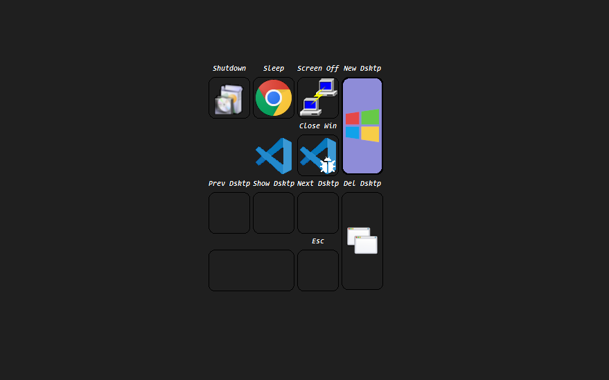

# AutoStreamDeck
*The starting point to build your perfect macro keyboard.*

Define macro layers and macros in code, automatically bound to your macro pad buttons. A user interface is generated from your configuration for easy management.

## Getting Started

1. **Install [AutoHotkey v2](https://www.autohotkey.com/download/)**
2. **Edit `config.ahk`** – This is now the main configuration file for your macro pad. Here you define your layout, layers, and macros in a single place.
3. **Run `main.ahk`** – This will load your configuration and start the macro pad UI.

### Editing `config.ahk`

The `Config()` function in `config.ahk` returns a `Layout` object that defines your macro pad's structure. You specify:

- The function key (e.g., `ScrollLock`)
- The macro keys (e.g., `F13`–`F24`)
- The layers, each with a title, icon, and a list of macros

**Example:**

```ahk
Config() {
   return Layout(Key("ScrollLock", 4, 1, 2, 1), [
        Key("F13", 1, 1),
        Key("F14", 1, 2),
        Key("F15", 1, 3),
        Key("F16", 2, 1),
        Key("F17", 2, 2),
        Key("F18", 2, 3),
        Key("F19", 3, 1),
        Key("F20", 3, 2),
        Key("F21", 3, 3),
        Key("F22", 1, 4, 1, 2),
        Key("F23", 3, 4, 1, 2),
        Key("F24", 4, 3)
    ], [
      Layer("Programs", Icon("programs"), [
         Macro(OpenPowershell, "Powershell", "Open Powershell"),
         Macro(OpenCommandPrompt, "Cmd Prompt", "Open Command Prompt"),
         Macro(OpenFileExplorer, "File Explorer", "Open File Explorer"),
      ]),
      Layer("VS Code", Icon("vs_code"), [
         Macro(VsCodeGoToDefinition, "Go to Def", "Go to Definition in VS Code"),
         ...
      ]),
      ...
   ], 11, " " , true, true, , )
}
```

## Layout Objects

### Setting up the Layout Object

The `Layout` object controls the structure and display of your macro pad. You create it in `config.ahk` using:

```ahk
Layout(FunctionKey, MacroKeys, Layers := [], Default := 1, ShowFn := false, ShowMacroMarkers := false, ShowLabels := false, UseMacroIcons := false, IconAction := "Layer")
```

**Parameters:**

- `FunctionKey` – The key used as the function key (e.g., `Key("ScrollLock", 4, 1, 2, 1)`).
- `MacroKeys` – An array of macro key definitions (e.g., `Key("F13", 1, 1)`, ...).
- `Layers` – An array of layer objects (see above for how to define layers and macros).
- `Default` – (Optional) The default layer index to start on (default: 1).
- `ShowFn` – (Optional) Show the function key outline (default: false).
- `ShowMacroMarkers` – (Optional) Show macro markers on the buttons (default: false).
- `ShowLabels` – (Optional) Show labels on the buttons (default: false).
- `UseMacroIcons` – (Optional) Use macro icons on buttons instead of layer icons when a macro is assigned and has a icon (default: false).
- `IconAction` – (Optional) Set icon click action: `"Layer"` to switch layers (default), or `"Macro"` to trigger the macro action.

See `lib/layout.ahk` for full documentation of all options and methods.

### Setting up the Layer Object

The `Layer` object represents a set of macros grouped under a title and icon. You create it in `config.ahk` or in your layers array using:

```ahk
Layer(Title := "", Icon := "", Macros := [])
```

**Parameters:**

- `Title` – The name of the layer (string).
- `Icon` – An `Icon` object for the layer (see below).
- `Macros` – An array of macro objects (see above for how to define macros).

See `lib/layer.ahk` for full documentation.

### Setting up the Icon Object

The `Icon` object manages the images used for a layer or macro button in different states. You create it by passing the name of the icon set (which matches a folder in `img/`).

```ahk
Icon(name)
```

**Parameters:**

- `name` – The name of the icon folder inside `img/` (string).

This will automatically set the following properties:

- `icon.layer` – Path to the default layer icon (`img/name/layer.png`)
- `icon.macro` – Path to the macro icon (`img/name/macro.png`)
- `icon.selected` – Path to the selected layer icon (`img/name/selected.png`)
- `icon.selectedMacro` – Path to the selected macro icon (`img/name/selected_macro.png`)

See `lib/icon.ahk` for full documentation.

### Setting up the Macro Object

The `Macro` object represents an individual macro action. You create it by specifying the function to call, a label, optionally, a description, or optionally an icon.

```ahk
Macro(Action, Name, Description := "", Icon := "")
```

**Parameters:**

- `Action` – The function to be called when the macro is triggered.
- `Name` – The label for the macro (string).
- `Description` – (Optional) A brief description for tooltips or UI (string).
- `Icon` – (Optional) An `Icon` object for the macro (see above).

See `lib/macro.ahk` for full documentation.

### Where to define macro functions?

Macro functions (like `OpenPowershell`, `VsCodeGoToDefinition`, etc.) are defined in the `commands/` directory. You can add your own in `commands/custom/` and include them in `config.ahk`.

**Example custom macro:**

```ahk
; In commands/custom/vscode.ahk
VsCodeGoToDefinition() {
   Send("^F12") ; Ctrl+F12 in VS Code
}
```

## File Structure

- `config.ahk` – Main configuration (edit this file)
- `main.ahk` – Entry point, loads your config and starts the UI
- `commands/` – Macro function definitions (grouped by category)
- `lib/` – Core library code (do not edit unless customizing core behavior)
- `img/` – Icons and images for the UI

## Showcase

### Example with Numpad
